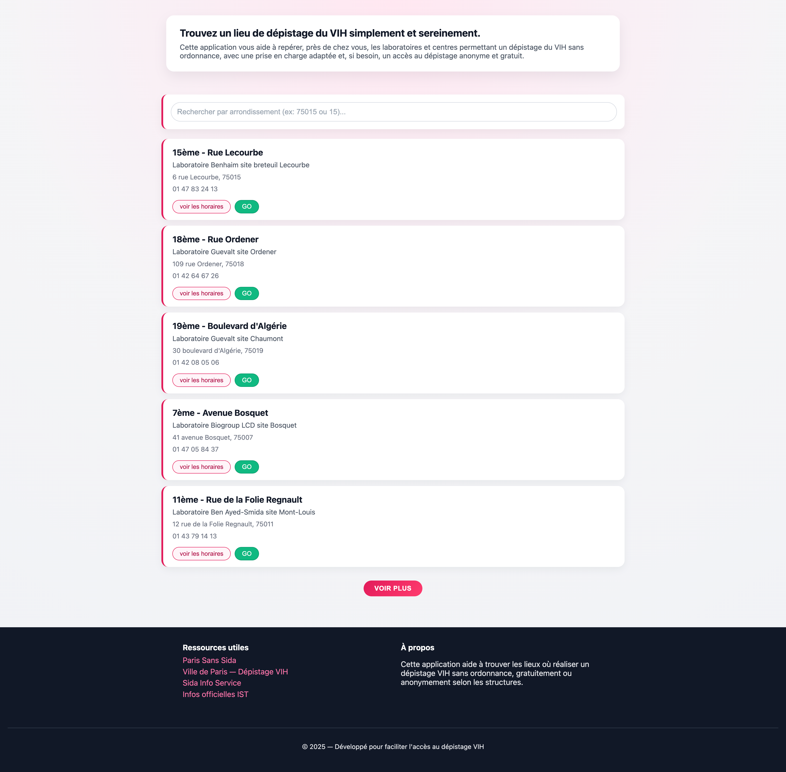

# Adataviz

### Dépistage VIH accessible à Paris

## 

Adataviz est une application web conçue pour faciliter l'accès à l'information sur le dépistage du VIH à Paris. Développée dans le cadre d'un projet solo utilisant exclusivement du `JavaScript Vanilla`, HTML et CSS, elle permet de localiser rapidement les laboratoires effectuant des tests **sans ordonnance**.

Ce projet a été initié en marge de la **Journée mondiale de lutte contre le Sida** (28 novembre 2025), avec une attention particulière portée aux jeunes — public chez qui l'on observe une augmentation des cas — afin de garantir un accès rapide, anonyme et gratuit à la prévention.

---

## 🚀 Fonctionnalités — Version 1.0

La version actuelle offre une expérience fluide et légère, optimisée pour la performance :

| Fonctionnalité            | Description                                                                                         |
| ------------------------- | --------------------------------------------------------------------------------------------------- |
| **Recherche instantanée** | Filtrage en temps réel des laboratoires via la barre de recherche, sans rechargement de page.       |
| **Affichage optimisé**    | Chargement progressif ("Voir plus") pour afficher davantage de résultats sans ralentir l'interface. |
| **Cartes interactives**   | Présentation claire des laboratoires sous forme de cartes informatives.                             |
| **Détails contextuels**   | Bouton "Voir les horaires" pour dévoiler les plages d'ouverture à la demande.                       |
| **Données officielles**   | Consommation de l'**API REST Open Data de la Ville de Paris** (OpenDataSoft — licence ODbL) pour des données publiques, gratuites et à jour.
                    |
---

## 🛠 Stack technique
 
| Technologie | Usage |
|---|---|
| JavaScript Vanilla | Logique applicative & manipulation du DOM |
| HTML / CSS | Structure & styles |
| API REST Open Data Paris | Source de données publiques (OpenDataSoft, licence ODbL) |
| Vite | Outil de build & serveur de développement |
| Vercel | Déploiement |

---

## 🛠 Installation et lancement

Ce projet utilise **Vite** comme outil de build. Vous aurez besoin de `Node.js` installé sur votre machine.

**Installer les dépendances**

```bash
pnpm install
```

Ou avec `npm` :

```bash
npm install
```

**Lancer le serveur de développement**

```bash
pnpm run dev
# ou
npm run dev
```

---

## 🗺️ Feuille de route — Version 2.0

Le projet est en évolution constante. Les prochaines itérations viseront à renforcer l'aspect géographique et l'inclusivité :

- **Recherche explicite** — Ajout d'un bouton "Rechercher" dédié pour la barre de recherche.
- **Cartographie interactive** — Intégration de la bibliothèque Leaflet pour afficher les laboratoires sur une carte réelle.
- **Élargissement des données** — Connexion à une API recensant les CeGIDD (Centres gratuits d'information, de dépistage et de diagnostic) pour inclure les lieux de dépistage anonyme et gratuit.

---

## 🤝 Contribution

Bien que ce soit un projet solo académique pour le moment, les retours sur l'accessibilité ou l'optimisation du code Vanilla JS sont les bienvenus via les **Issues GitHub**.
